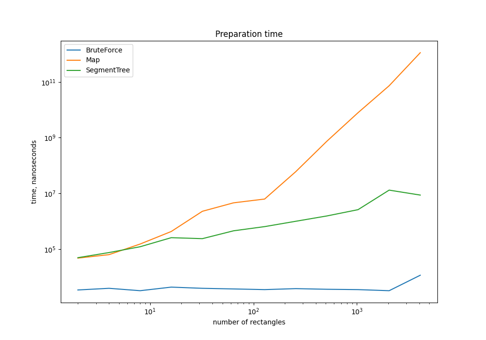
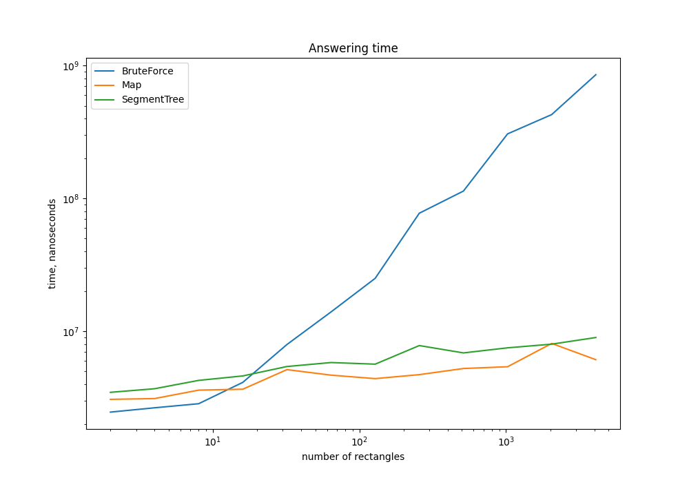
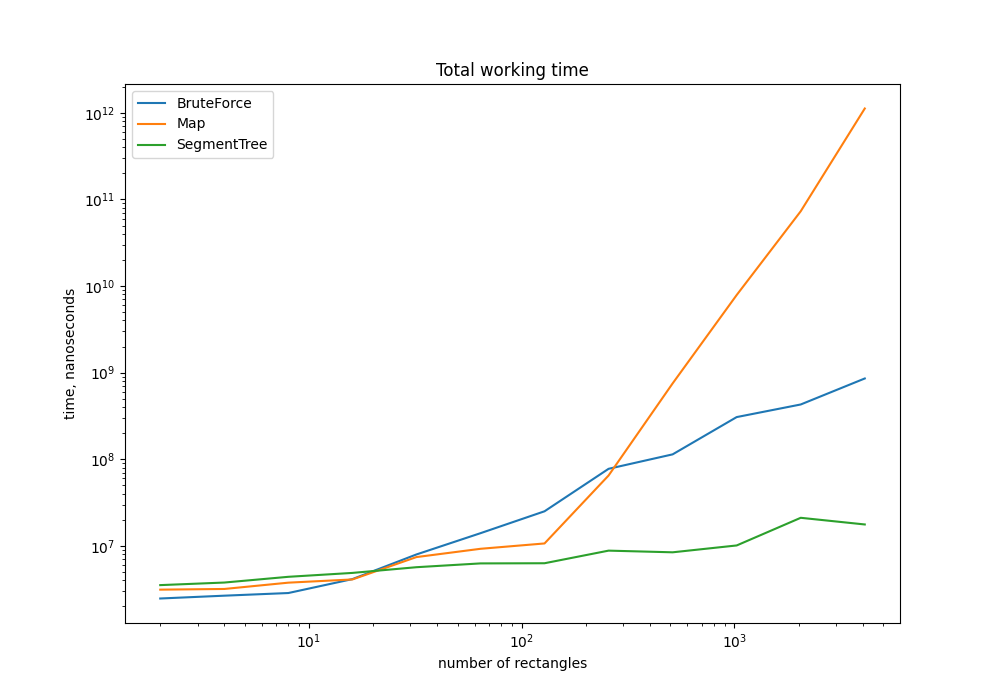

## АиСД - Лабораторная работа №2

Реализация 3 алгоритмов по поиску количества вложенных прямоугольников
в заданной точке на координатной плоскости.

---

### Входные данные

Даны `N` прямоугольников и `M` точек на координатной плоскости. Хранение прямоугольников
происходит по координатам точек левого нижнего (`left`) и правого верхнего углов (`right`).

```kotlin
class Point (val x: Int, val y: Int)
class Rectangle (val left: Point, val right: Point)
```

### Выходные данные

Для каждой из `M` точек узнать количество вложенных прямоугольников.

---

## Автоматическая генерация 

Для автоматизации и ускорения процесса тестирования было рекомендовано использовать формулы для 
генерации заданного числа прямоугольников и соответствующего набора точек.

Формула генерации прямоугольников подразумевает создание N вложенных друг в друга прямоугольников.


```kotlin
fun getRectanglesArray(n: Int) : Array<Rectangle> {
    val rectangles: Array<Rectangle> = Array(n) { Rectangle(Point(0, 0), Point(0, 0)) }

    for (i in 0 until n) {
        rectangles[i] = Rectangle(Point(10 * i, 10 * i), 
                                  Point(10 * (2 * n - i), 10 * (2 * n - i)))
    }

    return rectangles
}
```

Формула генерации набора точек подразумевает создание неслучайного набора точек распределённых
более-менее равномерно по ненулевому пересечению прямоугольников с помощью хеш функции от `i`
с разным базисом для `x` и `y` (`(p * i)^31 % (20 * N)`, где `p` большое простое, разное для `x` и `y`).

```kotlin
fun getTestPointsArray(m: Int, n: Int) : Array<Point> {
    val testPoints: Array<Point> = Array(m) { Point(0, 0) }

    for (i in 0 until m) {
        testPoints[i] = Point((((10007 * i).toDouble().pow(31)) % (20 * n)).toInt(),
                               ((10009 * i).toDouble().pow(31) % (20 * n)).toInt())
    }

    return testPoints
}
```

---

## Реализации алгоритмов

### Полный перебор

Алгоритм не подразумевает дополнительной обработки данных перед началом поиска ответов к заданным точкам.
Весь смысл данного алгоритма в поочерёдном переборе каждого прямоугольника и проверке выполнения условия на то,
лежит ли точка в границах текущего прямоугольника.

```kotlin
fun bruteForceAlgorithm(rectangles: Array<Rectangle>, points: Array<Point>) : Array<Int> {
    val answersForPoints = Array(points.size) { 0 } // Array of answers to each given point

    for (i in points.indices) {
        for (j in rectangles.indices) {
            if (points[i].x >= rectangles[j].left.x && points[i].x < rectangles[j].right.x &&
                points[i].y >= rectangles[j].left.y && points[i].y < rectangles[j].right.y) {
                answersForPoints[i]++
            }
        }
    }

    return answersForPoints
}
```

Сложность: `O(N * M)`, где `N` - количество прямоугольников, `M` - количество точек.

### Алгоритм на карте с сжатыми координатами

Второй алгоритм подразумевает дополнительную предобработку данных в виде построения сжатой карты
прямоугольников на координатной плоскости.

Для начала необходимо сжать координаты наших прямоугольников по обеим осям. Для этого запишем
все координаты прямоугольников по `x` в массив иксов `zippedX`, а координаты по `y` в массив
`zippedY`. Далее отсортируем их по возрастанию и избавимся от повторений. На выходе получаем два массива, в которых индексы будут являться сжатыми координатами.

```kotlin
fun getZippedCoordinates(rectangles: Array<Rectangle>) : Pair<List<Int>, List<Int>> {
    val zippedX = Array(rectangles.size * 2) { 0 }
    val zippedY = Array(rectangles.size * 2) { 0 }
    var j = 0

    // get zipped coordinates for building matrix
    for (rectangle in rectangles) {
        zippedX[j] = rectangle.left.x
        zippedY[j] = rectangle.left.y
        zippedX[j + 1] = rectangle.right.x
        zippedY[j + 1] = rectangle.right.y
        j += 2
    }
    // sorting zipped coordinates
    zippedX.sort()
    zippedY.sort()

    return Pair(zippedX.distinct(), zippedY.distinct())
}
```

После сжатия координат можно приступать к заполнению матрицы карты. Для каждого прямоугольника ищем индексы в матрице по сжатым координатам и 
делаем +1 в найденных границах.

```kotlin
fun generateMap(rectangles: Array<Rectangle>, zippedX: List<Int>, zippedY: List<Int>) : Array<Array<Int>> {
    // creating empty map
    val mapMatrix = Array(zippedY.size) { Array(zippedX.size) { 0 } }

    // filling map
    for (rectangle in rectangles) {
        val indexStartX = findPosition(zippedX, rectangle.left.x)              
        val indexStartY = findPosition(zippedY, rectangle.left.y)              
        val indexEndX = findPosition(zippedX, rectangle.right.x)     
        val indexEndY = findPosition(zippedY, rectangle.right.y)        

        for (i in indexStartY until indexEndY) {
            for (j in indexStartX until indexEndX)  {
                mapMatrix[i][j]++
            }
        }
    }

    return mapMatrix
}
```
Сложность подготовки: `O(N^3)`, где `N` - количество прямоугольников. 

На этом предобработка завершена, можно преступать к поиску ответов к точкам. Нам необходимо
определить расположение точки на нашей карте. Для этого нужно найти индексы координат точки в массиве сжатых координат прямоугольников.
Ответ для точки будет лежать в нашей матрице (карте) по полученным индексам.

```kotlin
fun getAnswersFromMap(mapMatrix: Array<Array<Int>>, points: Array<Point>, zippedX: List<Int>, zippedY: List<Int>) : Array<Int> {
    val answersForPoints = Array(points.size) { 0 }
    
    for (i in points.indices) {
        val positionX = findPosition(zippedX, points[i].x)  // get indexes of point position on the map
        val positionY = findPosition(zippedY, points[i].y)  //

        if (positionX == -1 || positionY == -1) {   // if point out of borders
            answersForPoints[i] = 0
        } else {
            answersForPoints[i] = mapMatrix[positionY][positionX]
        }
    }

    return answersForPoints
}
```

Сложность ответа: `O(M*logN)`, где `M` - количество точек, `N` - количество прямоугольников.

### Алгоритм на персистентном дереве отрезков

Третий алгоритм также подразумевает предобработку входных данных в виде сжатия координат, только
в этом случае вместо карты прямоугольников будет строиться персистентное дерево отрезков.

Для сжатия координат используется таже функция, описанная выше (см. [Алгоритм на карте с сжатыми координатами](#алгоритм-на-карте-с-сжатыми-координатами)).

После сжатия координат нам необходимо составить массив событий, происходящих на нашей координатной плоскости.
Под событием подразумевается начало или конец существования прямоугольника на плоскости.
Каждое событие включает в себя `x` координату события, `yBegin` - нижнюю границу прямоугольника, `yEnd` - верхнюю границу прямоугольника
и `status` обозначающий тип события (`1` - начало, `-1` - конец).

```kotlin
class Event (val x: Int,
             val yBegin: Int,
             val yEnd: Int,
             val status: Int)
```

После составления массива событий строим пустое дерево отрезков на массиве 0 длинной равной массиву сжатых игреков `zippedY`.

Далее идём по массиву событий и производим операцию добавления на дереве отрезков с созданием новых персистентных узлов при изменении. 
В случае если `status` у `Event` равен 1, то производится
операция `+1` на отрезке `[yBegin; yEnd]`, иначе если `status` равен -1 производится операция `-1` на отрезке.

Реализация добавления:

```kotlin
fun add(node: Node, start: Int, end: Int, value: Int) : Node {
    // if current node is in interval, return *new persistent* node
    if (start <= node.leftIndex && node.rightIndex <= end) {
        return Node(node.sum + value, node.left, node.right, node.leftIndex, node.rightIndex)
    }

    // if current node is not in interval, return node
    if (node.rightIndex <= start || end <= node.leftIndex) {
        return node
    }

    // creating *new persistent* node
    val new = Node(node.sum, node.left, node.right, node.leftIndex, node.rightIndex)

    // checking left node
    new.left = add(new.left!!, start, end, value)

    // checking right node
    new.right = add(new.right!!, start, end, value)

    // return *new persistent* node
    return new
}
```

При изменении у `Event` координаты по `x` добавляем текущий персистентный корень в массив `roots`.

После перебора всех событий массив `roots` будет длинной равной массиву `zippedX`, то есть на каждый сжатый
`x` у нас будет свой корень в персистентном дереве отрезков.

Сложность подготовки: `O(N*logN)`, где `N` - количество прямоугольников.

Для ответа к точке необходимо найти нужный корень в массиве `roots` через поиск нужного индекса в массиве `zippedX` и спустится
в дереве до нужного листа, собрав по пути все нужные модификаторы.

```kotlin
fun getAnswer(node: Node?, target: Int): Int {
    // if node == null -> lower level reached
    if (node != null) {
        val mid = (node.leftIndex + node.rightIndex) / 2
        return if (target < mid) {
            node.sum + getAnswer(node.left, target)
        } else {
            node.sum + getAnswer(node.right, target)
        }
    }
    return 0
}


fun getAnswersFromPersistentTree(points: Array<Point>, roots: Array<Node>, zippedX: List<Int>, zippedY: List<Int>) : Array<Int> {
    val answersForPoints = Array(points.size) { 0 }

    // searching answers for given points
    for (i in points.indices) {
        val positionX = findPosition(zippedX, points[i].x)  // get indexes of point position on the map
        val positionY = findPosition(zippedY, points[i].y)  //

        if (positionX == -1 || positionY == -1) {   // if point out of borders
            answersForPoints[i] = 0
        } else {
            answersForPoints[i] = getAnswer(roots[positionX], positionY)
        }
    }

    return answersForPoints
}
```

Сложность ответа: `O(M*logN)`, где `M` - количество точек, `N` - количество прямоугольников.

---

## Тестирование и выводы

Тестирование времени работы алгоритмов производилось на следующем наборе данных:
* Количество прямоугольников равно `2^i`, где `0 <= i <= 12`
* Количество точек для каждого набора прямоугольников одинаково и равно `100000`
 
Так как у всех алгоритмов различная асимптотика предобработки и ответа на запрос, измерение 
времени работы этих двух частей было разделено.

### Измерение времени предобработки



Из данного графика видно, как быстро начинает расти время предобработки данных с ростом количества прямоугольников во втором алгоритме (алгоритм на карте).
В первую очередь это происходит из-за довольно большой асимптотики построения карты (`O(N^3)`). Она получается из-за того, что 
в худшем случае программе придётся `N` раз пройтись по все матрице карты размером `N * N` и уже на достаточно маленьких числах будет занимать
огромное количество времени. Что касается двух других алгоритмов, то ситуация обстоит намного лучше. Построение персистентного дерева отрезков на очень маленьких
числах занимает столько же сколько и построение карты, но график растёт намного медленнее, что делает предобработку алгоритма на дереве быстрее карты уже на
16 прямоугольниках и в десятки и сотни раз быстрее на больших данных. Алгоритму полного перебора не требуется какая-либо предобработка, поэтому время ~= 0.

### Измерение времени ответа



На графике видно, что на маленьких числах все алгоритмы работают примерно одинокого, но как только количество прямоугольников 
становится `>16` время работы алгоритма полного перебора начинает стремительно расти, два других остаются примерно на том же уровне.
Данный график наглядно показывает, насколько сложность ответа для одной точки полным перебором `O(N)` хуже сложности ответа по предварительно подготовленным
данным (в двух других алгоритмах сложность ответа для одной точки `O(logN)`). Также стоит подробнее рассмотреть быстрые алгоритмы ответа. Хоть они и имеют одинаковую сложность
алгоритм на карте справляется стабильно быстрее алгоритма на дереве. Это можно объяснить тем, что алгоритму на дереве для нахождения ответа
для точки необходимо совершить помимо двух бинарных поисков (`O(2*logN)`) индексов точек в массивах сжатых координат ещё и спуск по дереву (`O(logN)`). Следовательно,
у алгоритма на дереве получается константа больше, чем у алгоритма на карте.

### Общее время работы



График общего времени работы двух алгоритмов показывает, что алгоритм на карте на больших данных проигрывает двум другим 
алгоритмам по времени работы несмотря на свою достаточно быструю скорость нахождения ответа на карте и уже на 256 прямоугольниках становится хуже
полного перебора. В свою очередь время работы алгоритма на дереве растёт стабильно медленно и становиться самым лучшим уже на 32 прямоугольниках. 

Исходя из полученных результатов можно сказать, что алгоритм на персистентном дереве отрезков будет уместен и рационален на 
любых данных. В то же время, из-за высокой сложности реализации персистентного дерева отрезков, будет уместно использовать алгоритм на 
карте на о-очень **маленьком** количестве прямоугольников и ооочень **большом** количестве запрашиваемых точек. Также, если
входные данные по количеству точек и прямоугольников достаточно малы можно воспользоваться обычным перебором ввиду его простоты и скорости реализации.

Сырые данные для графиков, скрипт для их построения и сами графики можно найти [тут](artefacts).
Код запуска тестов находится [тут](src/main/kotlin/timeMeasuring.kt).
